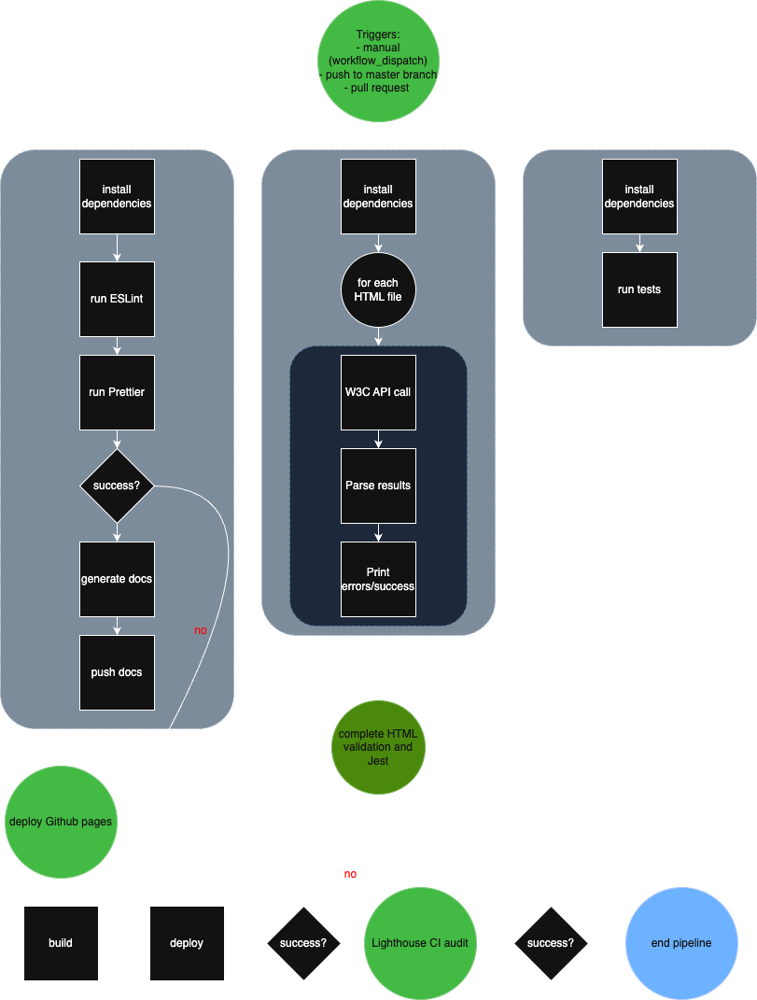

# CI/CD Pipeline Implementation Status Report



As part of our development strategy for building a clean, well-engineered Minimum Viable Product (MVP), we are designing a CI/CD pipeline that ensures code consistency, minimizes bugs, and maintains high-quality standards. While all components are currently **planned but not yet functional**, this document outlines the **purpose**, **planned functionality**, and **likely GitHub Actions integration** method for each component of our pipeline. All Github Actions integrations for each component will be consolidated into a single yaml file `.github/workflows/[name].yaml`, with additional specialized files as needed, and will be triggered on both `push` and `pull_request` events, such as:
```yaml
name: CI Pipeline
on: [push, pull_request]
jobs:
  lint:
    ...
  test:
    ...
  jsdoc:
    ...
  lighthouse:
    ...
  validate:
    ...
```

- ✅ **Implemented and Functional**
- ⚠️ **Planned (Not Yet Functional)**

---

## ✅ Linting with ESLint + Prettier

**Status**: Functional

### Why
Linting and formatting are foundational for maintaining code consistency and readability. By using ESLint and Prettier together, and basing our shared configuration on W3Schools JavaScript conventions, we ensure that all contributors follow a unified code style, reducing errors related to syntax and formatting. We will also use ESLint for CSS validation for consistency, performance, and maintainability of our CSS code. 

### How
The pipeline will run ESLint and Prettier checks on every PR. This prevents code with style or syntax violations from being merged into the main branch.

### GitHub Actions Integration
```yaml
lint:
    runs-on: ubuntu-latest
    steps:
      - uses: actions/checkout@v4
      - name: Setup Node.js
        uses: actions/setup-node@v4
        with:
          node-version: '20'
      - name: Install dependencies
        run: npm ci
      - name: Run ESLint
        run: npx eslint . --ext .js
      - name: Run Prettier
        run: npx prettier --check .
```

---

## ✅ Unit Testing via Jest

**Status**: Functional

### Why
Unit testing is essential for verifying the correctness of individual components and functions in our codebase. By automating these tests through our CI pipeline, we can quickly detect regressions and ensure that new changes don’t break existing functionality. Jest is a widely-used JavaScript testing framework that offers fast execution, clear output, and built-in code coverage reporting — making it ideal for our project’s needs.

### How
Tests will be written using the Jest framework and stored alongside the components they cover. On every push and pull request, the pipeline will run all unit tests and fail the build if any test fails. This guarantees that only code which passes all tests can be merged into the main branch.

### Github Actions Integration
```yaml
test:
  runs-on: ubuntu-latest
  steps:
    - uses: actions/checkout@v4

    - name: Setup Node.js
      uses: actions/setup-node@v4
      with:
        node-version: '20'

    - name: Install dependencies
      run: npm ci

    - name: Run Jest tests
      run: npx jest --ci
```

---

## ⚠️ Lighthouse Auditing (Accessibility and Performance)

**Status**: Planned (Not Yet Functional)

### Why

Lighthouse is a powerful tool developed by Google that audits web pages for performance, accessibility, SEO, and more. By integrating Lighthouse into our CI/CD pipeline, we aim to catch issues that affect the user experience early in development. This is especially useful for ensuring our application is accessible and performs well under typical conditions, even for a class project.

### How

We will define a set of URLs to audit using Lighthouse, and include a `budget.json` file to specify performance thresholds. This helps us identify when performance or resource usage exceeds acceptable limits. Although the budget values may be strict for our MVP, they provide a structured starting point and can be adjusted later.

The results of the audits will be saved as GitHub Actions artifacts and temporarily uploaded to Lighthouse’s public storage for easy access and review.

### GitHub Actions Integration
```yaml
lighthouse:
  runs-on: ubuntu-latest
  steps:
    - uses: actions/checkout@v4
    - name: Audit URLs using Lighthouse
      uses: treosh/lighthouse-ci-action@v12
      with:
        urls: |
          https://example.com/
          https://example.com/blog
        budgetPath: ./budget.json
        uploadArtifacts: true
        temporaryPublicStorage: true
```

---

## ⚠️ JSDoc Comment Coverage

**Status**: Planned (Not Yet Functional)

### Why

JSDoc is a documentation generator for JavaScript that enables developers to write structured, standardized comments that can be compiled into readable documentation. Automatically generating documentation during each CI run helps ensure that documentation stays up-to-date with the codebase, improves onboarding for new developers, and supports long-term maintainability.

### How

Developers will write JSDoc comments alongside their code. During each CI run, the pipeline will use the JSDoc tool to automatically generate documentation based on these comments. The generated documentation will be uploaded as a build artifact, allowing it to be reviewed or shared without manual intervention. This ensures that documentation is consistently buildable and reflects the current codebase.

### GitHub Actions Integration
```yaml
jsdoc:
  runs-on: ubuntu-latest
  steps:
    - uses: actions/checkout@v4
    - name: Setup Node.js
      uses: actions/setup-node@v4
      with:
        node-version: '20'
    - name: Install dependencies
      run: npm ci
    - name: Generate JSDoc
      run: npx jsdoc -c jsdoc.conf.json
    - name: Upload documentation artifact
      uses: actions/upload-artifact@v4
      with:
        name: jsdoc
        path: out/
```

---

## ✅ HTML Validation (⚠️ CSS Validation)

**Status**: HTML functional, CSS validation with `eslint` (see above)

### Why

Validating HTML and CSS ensures that our code adheres to W3C standards, improving cross-browser compatibility, maintainability, and accessibility. Automating this validation reduces the need for manual checks and flags potential issues earlier in the development process. By catching these issues automatically, we save time, reduce human error, and maintain code quality throughout the development cycle.

### How

We will integrate open-source tools like the W3C HTML and CSS validators into our GitHub Actions workflow. These tools will automatically check for common markup and style issues, ensuring that every PR is validated for basic compliance with web standards.

### GitHub Actions Integration
```yaml
validate:
  runs-on: ubuntu-latest
  steps:
    - uses: actions/checkout@v4
    - name: Validate HTML
      uses: Cyb3r-Jak3/html-validator-action@v1.0.4
      with:
        files: '**/*.html'
    - name: Validate CSS
      uses: stefanzweifel/csslint-action@v1
      with:
        files: '**/*.css'
```
