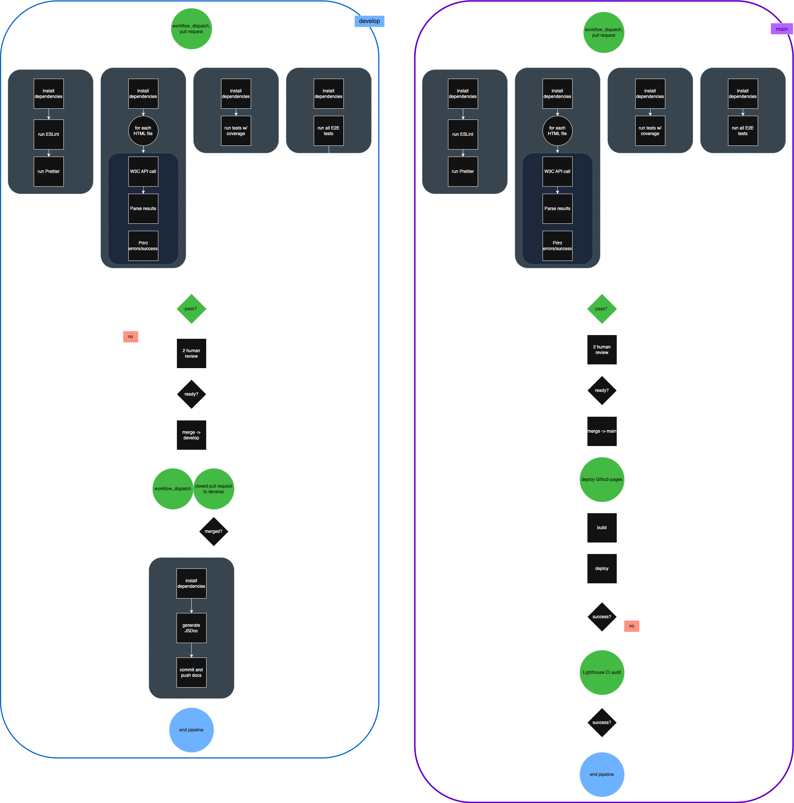

# CI/CD Pipeline Implementation Status Report (2)

## Working diagram:



As part of our development strategy for building a clean, well-engineered Minimum Viable Product (MVP), we are designing a CI/CD pipeline that ensures code consistency, minimizes bugs, and maintains high-quality standards. Since our last checkpoint, we have improved processes already implemented and increased functionality. With a more cemented branching strategy (protect and deploy from `main`, branch off of `develop` for features), we have distinguished a bit of functionality between these two branches. 

# Intended workflow

## ✅ Feature development 

Team members will branch off of `develop` to create their features. Then, when then they feel they are ready to open a PR, they should run `npm run lint` and `npm run format` locally (to make sure they are following our style guide). Then, they can open a PR to merge their feature branch into `develop`. This will trigger the main part of the pipeline, as defined in `main.yml`. 

## ✅ Linting with ESLint and Prettier (NEW: cleaned up process)

### Why
Linting and formatting are foundational for maintaining code consistency and readability. By using ESLint and Prettier together, and basing our shared configuration on W3Schools JavaScript conventions, we ensure that all contributors follow a unified code style, reducing errors related to syntax and formatting. We will also use ESLint for CSS validation for consistency, performance, and maintainability of our CSS code. 

### How
The pipeline will run ESLint and Prettier checks on every PR. This prevents code with style or syntax violations from being merged into the main branch.

### GitHub Actions Integration
```yaml
lint-and-docs:
    name: Lint with ESLint and Prettier
    runs-on: ubuntu-latest
    steps:
      - uses: actions/checkout@v4
      - name: Install Dependencies
        run: npm ci
      - name: Run ESLint
        run: npm run lint
      - name: Run Prettier
        run: npx prettier . --check
```

## ✅ HTML Validation with W3C API

### Why

Validating HTML ensures that our code adheres to W3C standards, improving cross-browser compatibility, maintainability, and accessibility. Automating this validation reduces the need for manual checks and flags potential issues earlier in the development process. By catching these issues automatically, we save time, reduce human error, and maintain code quality throughout the development cycle.

### How

We will integrate open-source tools like the W3C HTML into our GitHub Actions workflow. These tools will automatically check for common markup and style issues, ensuring that every PR is validated for basic compliance with web standards.

### GitHub Actions Integration
```yaml
name: Validate HTML
    runs-on: ubuntu-latest
    steps:
      - uses: actions/checkout@v4
      - name: Install jq
        run: sudo apt-get install -y jq
      - name: Validate HTML files using W3C API
        run: |
          failed=0
          for file in ./*.html; do
            if [ -f "$file" ]; then
              echo "Validating $file"
              response=$(curl -s -H "Content-Type: text/html; charset=utf-8" --data-binary "@$file" "https://validator.w3.org/nu/?out=json")
              messages=$(echo "$response" | jq '.messages | length')
              if [ "$messages" -eq 0 ]; then
                echo "✅ $file is valid"
              else
                echo "❌ $file has $messages issue(s):"
                echo "$response" | jq -r '.messages[] | "- [\(.type)] \(.message) at line \(.lastLine // "unknown")"'
                failed=1
              fi
            fi
          done
          exit $failed
```

## ✅ Run unit tests and code coverage with Jest (NEW: code coverage including HTML code coverage)

### Why
Unit testing is essential for verifying the correctness of individual components and functions in our codebase. By automating these tests through our CI pipeline, we can quickly detect regressions and ensure that new changes don’t break existing functionality. Jest is a widely-used JavaScript testing framework that offers fast execution, clear output, and built-in code coverage reporting — making it ideal for our project’s needs. Code coverage is important to ensure that we are writing useful tests, as a high percentage of code coverage tells us that passing/failing all of our tests is more informative. 

### How
Tests will be written using the Jest framework and stored alongside the components they cover. On every push and pull request, the pipeline will run all unit tests and fail the build if any test fails. This guarantees that only code which passes all tests can be merged into the main branch. To add code coverage, we needed to adjust `package.json` as well as `main.yml`. HTML code coverage will be generated as a reported and added to `/coverage`. 

### Github Actions Integration
```yaml
name: Unit Tests with Jest
    runs-on: ubuntu-latest
    steps:
      - uses: actions/checkout@v4
      - name: Install Dependencies
        run: npm ci
      - name: Run all tests with coverage
        run: npm test
      - name: Upload HTML Coverage Report
        uses: actions/upload-artifact@v4
        with:
          name: coverage-report
          path: coverage/lcov-report
```

## ✅ JSDoc generation (NEW: adjusted to work with our branching strategy)

### Why

JSDoc is a documentation generator for JavaScript that enables developers to write structured, standardized comments that can be compiled into readable documentation. Automatically generating documentation during each CI run helps ensure that documentation stays up-to-date with the codebase, improves onboarding for new developers, and supports long-term maintainability.

### How

Developers will write JSDoc comments alongside their code. When a pull request is merged onto `develop`, the `doc.yml` will run and generate, commit, and push docs. This had to be adjusted from the previous checkpoint because our branching strategy was implemented, leading us to protect the `main` branch. Due to issues pushing docs to a protected branch, we ended separating the JSDoc workflow from the `main.yml`. Now, we generate the docs on `develop` (which is not protected), and when we merge from `develop` onto `main`, the docs will be migrated over. 

### GitHub Actions Integration
```yaml
name: JSDoc Generation

on:
  workflow_dispatch:
  pull_request:
    branches:
      - develop
    types: [closed]

jobs:
  on-pr-merged:
    name: JSDoc
    if: github.event.pull_request.merged == true
    runs-on: ubuntu-latest
    steps:
      - uses: actions/checkout@v4
      - name: Install Dependencies
        run: npm ci
      - name: Generate JSDoc
        run: npx jsdoc -c jsdoc.json
      - name: Commit and push docs
        run: |
          git config user.name "github-actions[bot]"
          git config user.email "github-actions[bot]@users.noreply.github.com"

          git add docs
          git diff --cached --quiet || git commit -m "Update docs"
          git push origin develop
```

## ✅ Lighthouse Audit (NEW: separated workflow to be triggered from Github Pages)

### Why

Lighthouse is a powerful tool developed by Google that audits web pages for performance, accessibility, SEO, and more. By integrating Lighthouse into our CI/CD pipeline, we aim to catch issues that affect the user experience early in development. This is especially useful for ensuring our application is accessible and performs well under typical conditions, even for a class project.

### How

We will define a set of URLs to audit using Lighthouse, and include a `budget.json` file to specify performance thresholds. This helps us identify when performance or resource usage exceeds acceptable limits. Although the budget values may be strict for our MVP, they provide a structured starting point and can be adjusted later.

The results of the audits will be saved as GitHub Actions artifacts and temporarily uploaded to Lighthouse’s public storage for easy access and review. The Lighthouse Audit is triggered upon the deployment of Github Pages, which will be happening from our protected `main` branch. Because of this, we have a separate `lh.yml` file to run this workflow. 

### GitHub Actions Integration
```yaml
name: Lighthouse CI Audit
on:
  workflow_dispatch:
  workflow_run:
    workflows: ["pages-build-deployment"]
    types:
      - completed

jobs:
  lighthouse:
    if: ${{ github.event.workflow_run.conclusion == 'success' }}
    runs-on: ubuntu-latest
    steps:
      - name: Wait for GitHub Pages to go live
        run: sleep 60
      - uses: actions/checkout@v4
      - name: Audit URLs using Lighthouse
        uses: treosh/lighthouse-ci-action@v12
        with:
          urls: |
            https://cse110-sp25-group13.github.io/dummy_repo/
            https://cse110-sp25-group13.github.io/dummy_repo/expose.html
            https://cse110-sp25-group13.github.io/dummy_repo/explore.html
          budgetPath: ./budget.json
          uploadArtifacts: true
          temporaryPublicStorage: true
```

## Selenium/Puppeteer?
