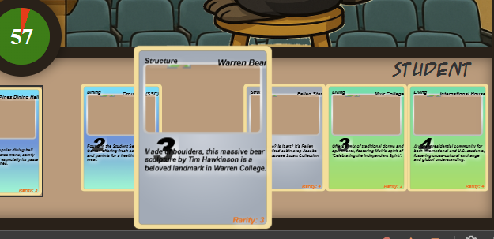

# Hand Testing with screenshots

#### When loading cards from the database, they were hugely disproportionate to the page, and the information that was meant to be displayed on the card was not in the right place.

#### Not only were the cards disproportionate, the character images that were meant to go on the game screen were not loading. 

#### While trying to implement a border on a card on hover, the border showed up inside the card boundaries. Plus, the icons did not load (which is the only readon we could see this border).

#### Generally, the icons meant to show up on the card were not loading, and we could see image-error icons right at the top of the card. 

#### We got the cards to fit better to the screen, but they were still too long and the icon pictures were squished into their slots. 

#### Icon images are not squeezed, but text still overflows from the cards.

#### The timer is supposed to start green at 60, but once the first 60 seconds elapsed it stayed red when it hit 60 again and then turned green at 59. 

#### The icon images for the card hugely overflowed so that you could see like 1/4 of the actual image.

#### The text in the instructions needs to be reformatted because it overflows the actual projector. 

#### The elements that were supposed to be at the top of the page malfunctioned and ended up in the wrong spots: the white boxes and the instruction text.

