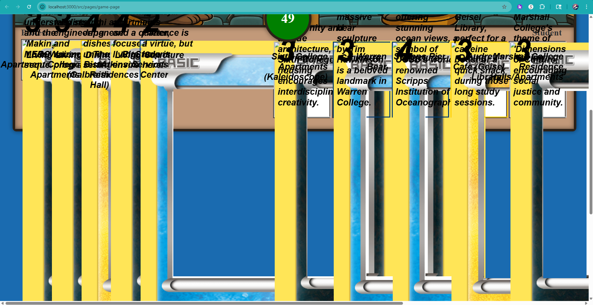
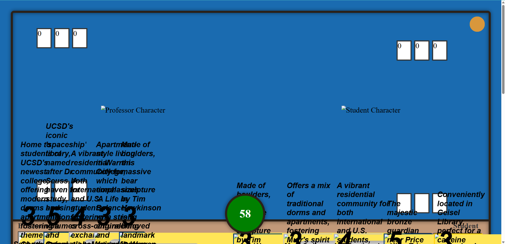
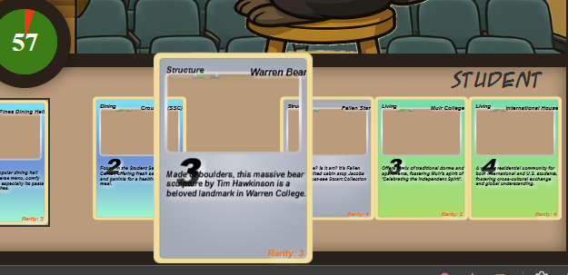

# Hand Testing with screenshots

#### When loading cards from the database, they were hugely disproportionate to the page, and the information that was meant to be displayed on the card was not in the right place.

#### Not only were the cards disproportionate, the character images that were meant to go on the game screen were not loading. 

#### While trying to implement a border on a card on hover, the border showed up inside the card boundaries. Plus, the icons did not load (which is the only readon we could see this border).

#### Generally, the icons meant to show up on the card were not loading, and we could see image-error icons right at the top of the card. 

