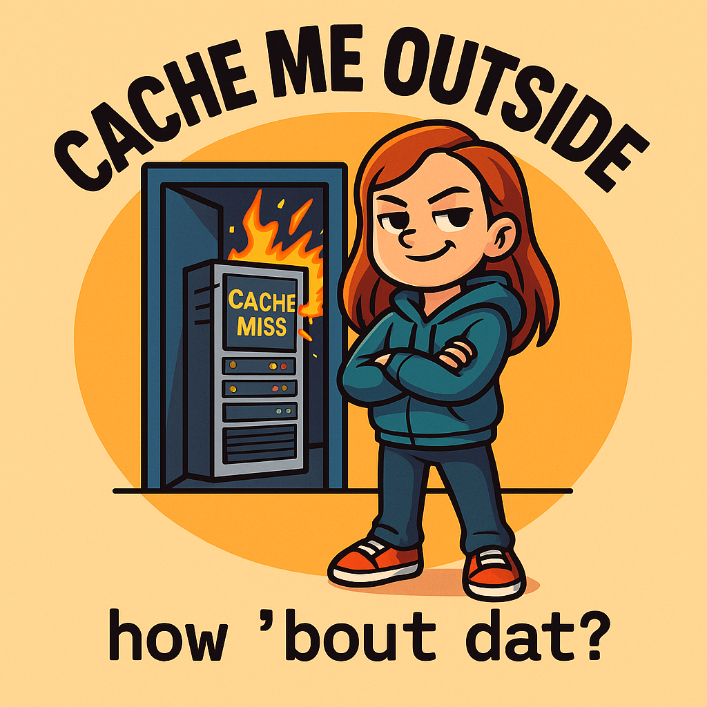

# Cache me outside



## Team brand (see branding directory)

# Values:
- Accountability: Take responsibility as a member of the team and any parts of the project you are working on. This includes things like being on time to meetings and communicating early and often if a conflict comes up.
- No judgement: Limit judgement on other members of the group not related to the project itself, as we want the group to be a safe space to share ideas and not worry about whether or not an idea will come across as "dumb". 
- Empathy: Value empathy, whether that's trying to understand team members when conflicts arise, or designing for the end user.
- !Ego (no ego). It's okay to be confident in your ideas but we don't want to start a cycle of being offended if someone doesn't like your idea/doesn't use it. Per the accountability bullet, we are all part of the same time and are all responsible for the success of this team! 
  
# Members:
🌐 Chencheng Li 🌌
- Major: Computer Science :computer:
- Fun Fact: Over spring break, I was either farming in Stardew Valley or jumping timelines in Split Fiction. Real life barely loaded. 🌾🌀
- [Github](https://github.com/chencheng-li)

- Darwin Smith
  
Haoting Huang 🍔
- Major: Math-CS
- Fun Fact: I can switch my eyes between double eyelids and single eyelids.
- [GitHub](https://github.com/sssssrrt01)
  
JayLynne Redeaux 👺
- Major(s): Computer science & Cognitive science 😮‍💨
- Fun Fact: I have two kitties and they are the GCOAT (greatest cats of all time) 🙀
- [GitHub](https://github.com/Jredeaux1)

Pranay Jha 🌧️
- Major: Computer Engineering 🤓
- Fun Fact: I hate JavaScript.
- [GitHub](https://github.com/psjcodes)

Ryan Garcia 🌋
- Major: Computer Science
- Fun fact: I've never watched/read any of the Harry Potter movies/books (sorry Zack😬)
- [GitHub](https://github.com/ryanrgarcia)

ChungYin Lee :space_invader: 
- Major: Computer Science
- Fun Fact: I have too many hours spent on steam and a collection of dolls :bear:
- [Github](https://github.com/LCY0502)
  
Zack Roland 
- Major: Math-Computer Science 🧮 💻
- Fun fact: I make it a goal every summer to rewatch Avatar the Last Airbender 🔥 :ocean: :rock: 💨from start to finish. Also I've reread the Harry Potter series over 5 times.
- [Github](https://github.com/ZackRoland)

:octopus: Kate Stadler :shell:
- Major: Cognitive Science :brain:
- Fun Fact: I once found an injured seagull at the beach and we called some sea bird rescue and waited like an hour and a half for a lady to come rescue it. Its name is Ferguson :shipit:
- [Github](https://github.com/kstad21)


:sparkles: Zhenyu Jiang :grey_question:
- Major: Computer Enginnering :pouting_cat:
- Fun fact: Unable to stop working sometime, love anime and gundam. :scream_cat:
- [Github](https://github.com/XDawn66)  	~~don't spy~~
- :point_right: Best code: ```print("Hello') console.log("Hello") cout<<"Hello"<<std::endl; system.out.print("Hello")``` 

👽 Nick Nguyen 🏰
- Major: Computer Science 🖥️
- Fun facts: I have been playing violin for 4 years. I like Ghibli Studio's movies and Ben & Jerry's ice cream.
- [Github](https://github.com/nicknguyen0201)

Destin Tanjuaquio
- Major: Computer Science
- Fun Fact: I like to listen to one song on repeat at a time.
- [Github](https://github.com/desticle)

| Contribution | Title | Description | link |
| ----------- | ----------- | ----------- | ----------- |
