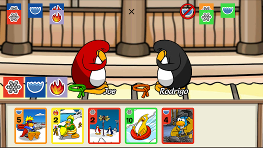
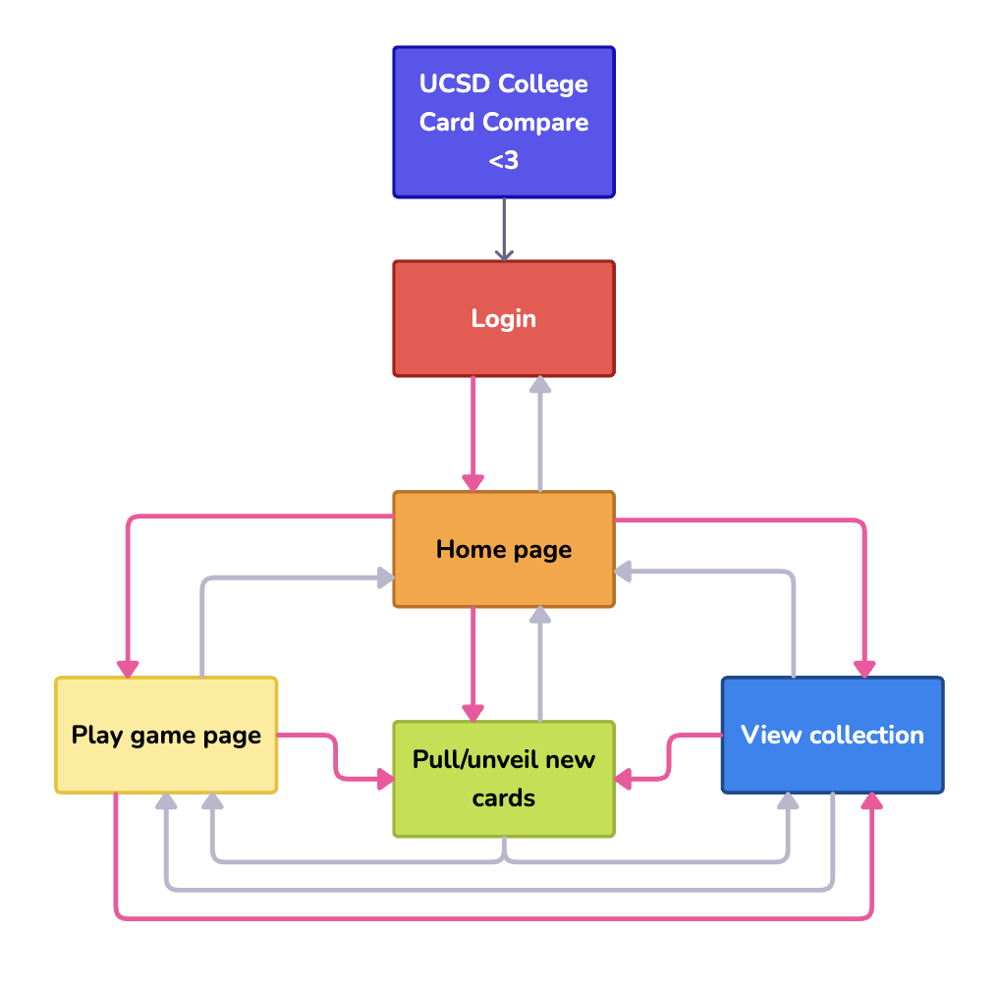
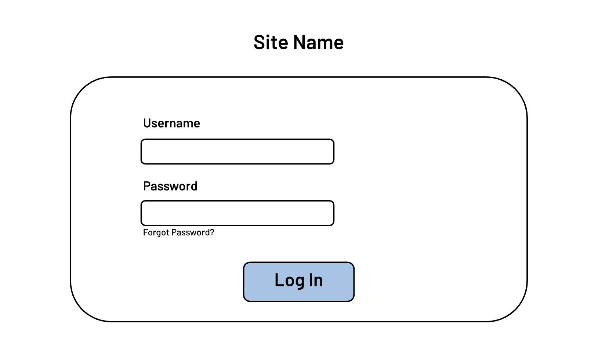
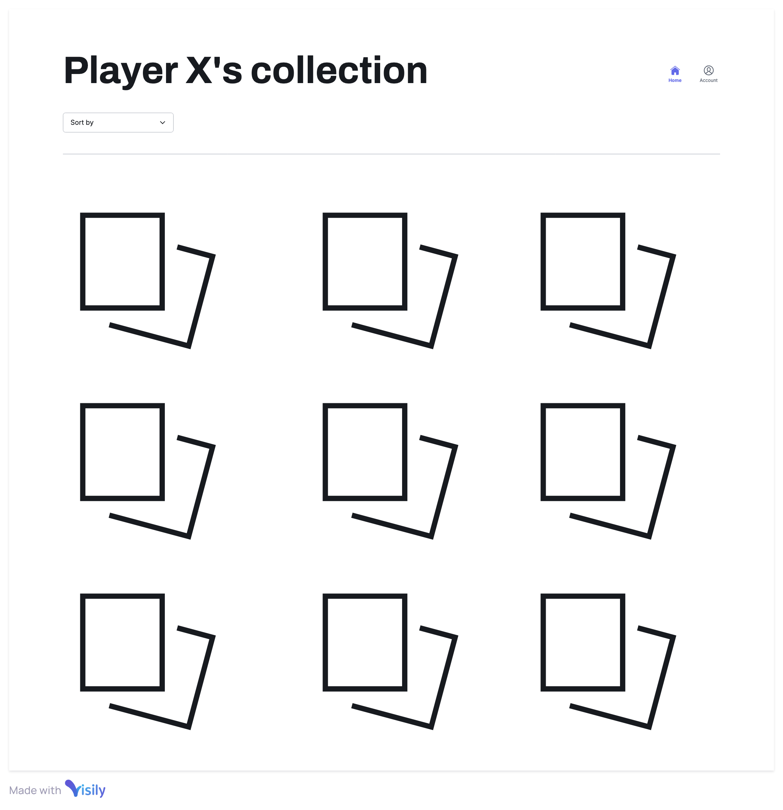
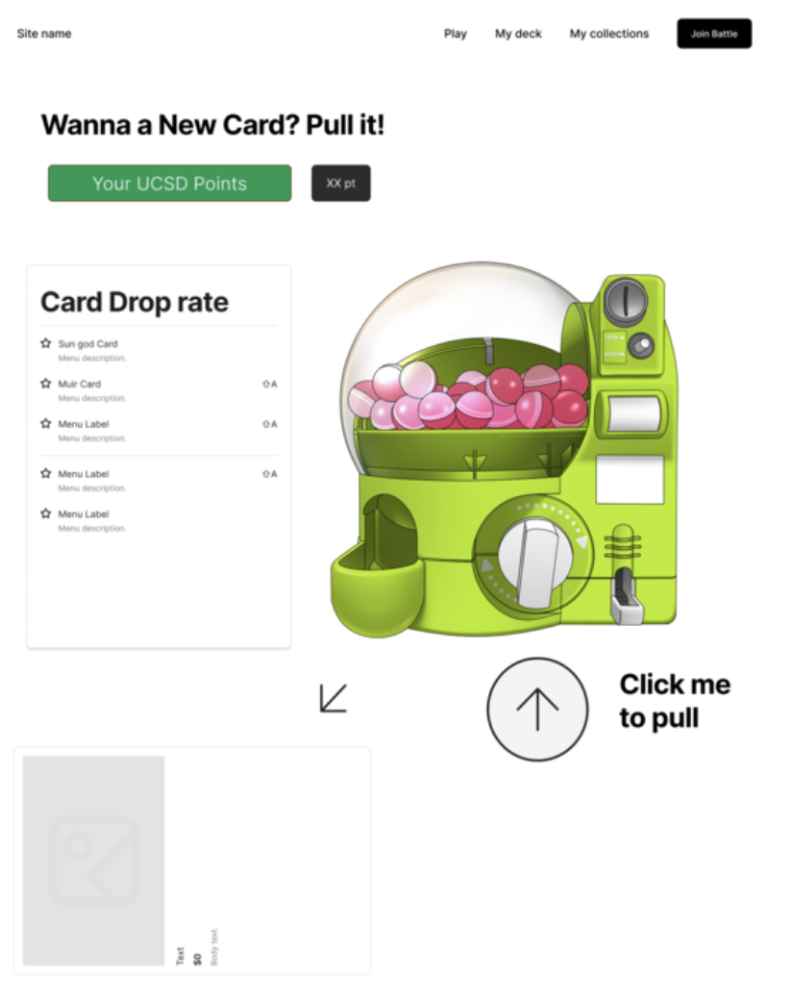

# Group 13 Pitch Document

### Statement of purpose:
UCSD College Card Compare is a web app designed to bring the spirit of campus life into a simple, collectible-card format. Our mission centers on three key goals:
1. **Nurture friendly rivalry**: Transform college pride into playful competition by letting students “duel” cards representing UCSD’s colleges, dining spots, monuments, and lecture halls. This lighthearted rivalry fosters community engagement and encourages students to learn more about each campus entity.
2. **Capture Campus Nostalgia**: In the wake of beloved themed worlds like Club Penguin closing down, we aim to recreate that same nostalgic charm: an offline, themed game that’s instantly accessible and fun to play.
3. **Educate and Inform**: Provide a visually engaging way for prospective and current students to discover the unique features and fun facts about each UCSD college and campus landmarks, helping them in their college decision-making and exploring campus.

### User personas:

### MVP Features:
- College Card View (Read):
  - Display a predefined, static set of "Cards" (Monument, dining, mascot, lecture hall),  each with card fun description that informs you about an aspect of UCSD at the bottom.
  - Data for these cards is stored locally (IndexedDB).
  - Example:
    - Monuments: Sun God, Geisel, Warren Bear
    - Dinings: 6th, 64, bistro
    - Lecture Halls: Revelle Galbraith, 6th, Warren
    - Mascot: Triton King
    - When 2 cards of the same type are played, use internal rank to break tie, eg: each dining hall has a rank compared to other dining halls: Bistro> Foodworx
- Basic Card Comparison Interface (Read + Simple Logic):
  - Allow the user to select cards from the library view.
  - Display the human and AI cards side-by-side.
  - Use the Logic (Monument>dining> mascot(lecture hall) > monument). Break ties by internal ranking of each category
  - Visually indicate which of the two cards is bigger
  - This is the entire "gameplay" loop for the MVP: select two, compare, see winner
- Local Data Storage:
  - Use IndexedDB to store the static college card data (names, image paths/blobs, attributes).
- Technology Stack:
  - HTML, CSS, vanilla JavaScript.
  - IndexedDB for local storage.
  - Web standard APIs 
- Key Simplifications for MVP stage:
  - Card Jitsu mechanics (elemental rock-paper-scissors, complex win conditions).
  - user creation, editing, or deletion of cards in the MVP.
  - AI opponent in the sense of the real smart AI model that learns pattern(Sensei Battle).
  - Gacha / random card acquisition / card packs.
  - Deck building or customization.
  - Music and Sound Effects
  - Multiplayer features, leaderboards, or social elements (clans).
  - Card leveling, evolution, or stat enhancement.
  - Complex card abilities, skills, or status effects.
  - Health points, mana, or complex resource/turn management.
  - Integration with external systems (grades, etc.).
  - User accounts or profiles.
  - User login
  - College assignment
  - Provide starter cards
  - User card collection
  - Card packs are available to open)
  - Microtransactions or any monetization features.
  - Complex animations or visual effects beyond basic UI feedback.
It is the MVP version, so we tried our best to simplify the project to its core. Additional features we talked about in the meeting are noted, but probably won't be implemented right away in the MVP version. Because it is supposed to be a super simple version for this stage). 

### Risks and rabbit holes:
**Risks**:
- Features creep:
    - increase complexity terms of Dev ➡️ increase developing time, increase cost
    - increase feature ➡️ less focused on what we are trying to deliver
    - increase complexity in terms of UX ➡️ difficult to use, distracting the user
    - What happens when we delay the deadline/ shipping time? Risk of being unable to finish the project.
- Not enough communication and collaboration between team members
**Rabbit Holes**:
- Design Work: 
  - Maybe lots of design work, that no one had done drawing/design before. How do we minimize the assets we need and the cost of making/finding assets while balancing the appearance of our game.
- User Database:
  - We have not done saving user data before, especially on a server. Are we capable of integrating a server into our application?
- UI:
  - How does the user interact with our page? What part of our page is interactive?
  - How to accommodate the fact that users are probably going to access our page in an infinite amount of ways? like they have different screen sizes, different browsers, or even different devices. 

## Visuals and wireframes
### Our inspiration: 

### Overall system diagram:

### Login page:

### Game page:
<to be added by Zack>

### View collection page:

### Pull / unveil new cards page: 

